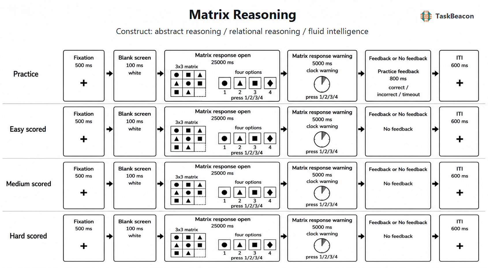

# 矩阵推理任务：关系规则归纳、流体推理测量及其方法学边界

矩阵推理任务（matrix reasoning task）要求个体从非言语图形阵列中提取属性变化及其关系，并据此补全缺失单元。该范式以较少的语言和知识要求考察新异问题求解，因而长期被用作流体推理与一般认知能力的指标。然而，正确作答同时依赖视觉特征编码、规则发现、关系整合、工作记忆维持、备选项检验和反应策略；总分或正确率不能直接等同于单一的“纯”流体智力过程（Carpenter et al., 1990; Chuderski, 2022）。矩阵题的规则构成、备选项设计、时限和题目暴露经验均会改变测量含义。研究设计因此需要将稳定的群体难度效应、个体差异测量和具体加工过程区分开来。

## 1. 范式起源与理论发展

Penrose 和 Raven（1936）最早报告了这类知觉关系测验，随后形成 Raven 渐进矩阵（Raven's Progressive Matrices, RPM）系列。其基本设计将待推断关系分布在二维阵列中，并以多项选择方式要求被试恢复缺失图形。早期“非言语”与“文化公平”的表述主要说明任务减少了显性词汇要求，不能据此排除教育经验、测验熟悉度、视觉加工方式和作答动机的影响。

加工理论的发展使矩阵成绩不再被视为不可分解的能力指标。Carpenter 等（1990）以项目分析和计算建模提出，个体需要发现图形属性及其变化规则、维持中间结果，并协调多个规则以构造答案；项目所含规则数量与目标管理负荷是难度的重要来源。后续参数化工作进一步把关系复杂度与一般任务难度分开：当需要同时整合的关系增加时，正确率、反应时和额叶活动均可发生系统变化（Christoff et al., 2001; Kroger et al., 2002）。这一发展将矩阵推理从单一总分测验转化为可操控规则、复杂度和策略的实验范式。

开放材料与程序化生成是另一项关键发展。Matzen 等（2010）建立了可系统生成 Raven 类项目的软件方法，使研究者能够操控规则和知觉特征而不重复使用受版权保护的题目。MaRs-IB 随后提供了 80 个开放矩阵项目及初步心理测量数据（Chierchia et al., 2019）；较大样本的项目反应理论分析表明，该题库覆盖较宽难度并具有中至较高的区分度，但外观相近的克隆题并不必然具有可交换的项目参数（Zorowitz et al., 2024）。因此，规则可复现不等于难度或区分度已经校准。

## 2. 任务逻辑、加工阶段与核心指标

典型项目呈现一个二维图形矩阵，其中右下单元缺失；被试从若干备选项中选择能够同时满足行、列或二者关系的图形。题目可操控形状、数量、位置、旋转、叠加或分布等属性，以及恒等、递进、加减和成对分布等关系。一个项目通常经历四个相互重叠的加工阶段：编码单元内属性；比较单元并形成候选规则；整合多个关系以生成目标表征；检查备选项并提交反应。正确率反映整个加工链能否完成，反应时则混合了搜索、检验、决策和速度—准确性权衡，二者均不能单独定位失败阶段（Carpenter et al., 1990; Laurence & Macedo, 2023）。

备选项使任务允许至少两类策略。构造匹配策略先在矩阵内部形成目标，再与选项比较；反应排除策略反复对照选项并逐一排除。眼动与问卷研究显示，两种策略对应不同的矩阵区与选项区注视分配，而且工作记忆容量与矩阵成绩的关联强度随策略而变（Li et al., 2022）。当项目设计降低仅凭局部特征排除答案的可能性时，矩阵成绩与其他推理指标的收敛关系可提高（Arendasy & Sommer, 2013; Becker et al., 2016）。备选项设计本身构成构念效度的一部分。

研究中应至少报告正式题正确率、遗漏率、正确反应时及项目难度分层；若项目参数已校准，可进一步估计能力参数。规则数、关系整合阶数与知觉复杂度需要分别编码。仅按“易、中、难”分组而没有经验校准时，该标签只能表示设计者预设的规则复杂度，不能替代项目反应理论参数。练习项目主要用于熟悉操作，其反馈和重复暴露可能诱发规则学习，正式分析不宜将其与计分项目合并。

## 3. 行为与认知神经科学证据

### 3.1 规则表征、工作记忆与策略

矩阵推理的核心要求是从多个可见属性中筛选与缺失单元相关的关系，并维持、组合和检验这些关系。关系数量增加通常提高错误率和作答时间，但该效应可同时来自工作记忆负荷、搜索空间扩大及更长的视觉检查。Chuderski（2022）据此将关系及其角色—填充项绑定视为流体推理的重要表征基础；这一观点能够解释为何矩阵成绩与工作记忆相关，也保留了视觉空间加工和策略差异的贡献。Li 等（2022）的结果进一步说明，工作记忆—成绩相关并非常数：采用排除策略者的关联高于采用构造匹配者。因而，组间矩阵成绩差异不能在缺乏过程指标时唯一归因于工作记忆或关系整合能力。

时间限制会改变这种混合。对 Raven 高级渐进矩阵不同长度与时限版本的元分析表明，缩短或速度化施测可能改变成绩所依赖的加工成分（Tatel et al., 2022）。12 题在线短版虽表现出单维结构及与 Wechsler 指标的中等至较高相关，但重测信度约为 .65–.69，且无时限版本在部分效度指标上更有优势（Poulton et al., 2022）。研究者需要把时限视为构念操控，而非单纯的实验管理参数。

### 3.2 关系复杂度的脑网络基础

任务态功能磁共振成像（functional magnetic resonance imaging, fMRI）较一致地支持额—顶网络参与矩阵推理，但不同条件对比对应不同解释。Prabhakaran 等（1997）直接比较解析型、图形型和知觉匹配题，发现图形推理相对匹配更多涉及右额叶和双侧顶叶，解析型题还招募双侧额叶及左侧顶枕颞区域；结果支持多个工作记忆与执行系统共同参与，而非单一脑区承担流体推理。Christoff 等（2001）在控制反应时与正确率后发现，双关系相对单关系题更强地涉及双侧额极外侧前额叶及右背外侧前额叶；Kroger 等（2002）的参数化研究同样表明前额叶活动随关系复杂度变化。这些对比支持关系整合与前额叶活动的关联，不能单独证明该区域对推理表现具有因果作用。

发展研究显示，儿童与成人完成 Raven 类关系推理时均动员额—顶区域，但额极外侧前额叶、背外侧前额叶与顶叶的参与模式随年龄变化（Crone et al., 2009）。这类横断面差异同时可能受策略、熟练度和表现匹配影响，不能被直接解释为单一脑区的成熟轨迹。较新的任务态网络分析把一次标准渐进矩阵作答区分为较早达到峰值的多需求网络搜索、随后出现的反应相关活动和更晚的重新评估活动，并发现困难题表现较低者表现出更高的多需求网络活动（Zurrin et al., 2024）。该结果为“搜索—作答—复核”的阶段模型提供了网络级证据，但血氧水平依赖（BOLD）信号的时间滞后及数据驱动网络分解限制了毫秒级阶段定位。

现有直接以矩阵项目为事件的电生理研究不足以形成与上述 fMRI 证据同等稳固的结论；许多 EEG/ERP 研究仅以 Raven 总分作为个体差异指标，而神经信号来自其他任务。将这些结果称为“矩阵推理的 ERP 成分”会混淆测量任务与神经记录任务，因此本范式的时间进程目前更适合结合眼动、反应时分解或专门设计的任务态 EEG 研究加以检验。

## 4. 方法学应用与解释边界

矩阵任务广泛用于发展、教育、神经心理与个体差异研究，其优势在于语言输出要求低、规则结构可参数化，并可在较短时间内获得准确率指标。发展性 fMRI 研究借助关系阶数操控考察儿童至成人的推理变化（Crone et al., 2009）；开放题库则支持在线施测、重复测量和跨研究复用（Chierchia et al., 2019; Zorowitz et al., 2024）。这些用途需要匹配不同的测量目标：群体平均难度效应可由少量项目检验，稳定估计个体能力则通常需要足够题量、合适难度覆盖和独立校准。

项目顺序本身也可能成为学习操控。个体在前若干题中逐步熟悉常见关系与选项结构，后续题目的成绩因而包含测验内规则学习；固定由易到难的题序还会使难度与位置完全混淆。重复测量若复用相同项目，则可能同时出现答案记忆、策略迁移和一般熟悉化。程序化生成与开放题库可以提供平行项目，但视觉结构相似或生成规则相同并不能保证心理测量等价（Matzen et al., 2010; Zorowitz et al., 2024）。纵向研究宜使用经独立样本校准的平行卷，记录既往矩阵测验经验，并将题序或版本纳入分析。

发展和临床应用还要求避免把较低语言负荷解释为无文化依赖。图形属性是否显著、从行或列归纳关系的习惯、速度要求以及对低风险在线测验的投入程度均可能影响表现。对儿童、老年人或临床群体使用同一短版时，遗漏既可能来自推理失败，也可能来自视知觉、运动反应、疲劳或对时限的适应差异。只有在目标群体中检验项目功能、测量不变性和外部效标关系后，原始正确率才适合跨群体比较；实验协变量也不应被视为无误差的“总体智力控制量”。

可靠性、效度与可解释性应分别评价。开放题库研究表明，经项目参数优化组卷可获得良好信度和收敛效度，但单个克隆题的参数仍可能不同（Zorowitz et al., 2024）。短版研究报告的中等重测信度也说明，稳定的平均正确率并不保证对个体排序的高精度（Poulton et al., 2022）。构念效度还受备选项排除、时限、反馈、题序学习和速度—准确性权衡影响（Arendasy & Sommer, 2013; Tatel et al., 2022）。因此，未经常模化的短任务适合描述当前样本中的项目表现或实验效应，不宜据其原始正确率生成 IQ、临床阈值或跨人群诊断结论。

## 5. TaskBeacon 中的任务实现

### 5.1 任务资源与访问入口

| 资源 | ID | 用途 | 地址 |
|---|---|---|---|
| PsychoPy/PsyFlow 源码 | T000049 | 本地行为实验完整实现 | [GitHub](https://github.com/TaskBeacon/T000049-matrix-reasoning) |
| 浏览器 companion 源码 | H000049 | 行为型网页伴随实现，保留相同 15 项流程 | [GitHub](https://github.com/TaskBeacon/H000049-matrix-reasoning) |
| 公共运行入口 | H000049 | 在线体验与行为数据导出 | [PsyFlow Web](https://taskbeacon.github.io/psyflow-web/?task=H000049-matrix-reasoning) |

T000049 当前版本是英文行为任务，使用程序生成且不复制商业 Raven 题目的 3 × 3 矩阵。H000049 是同一行为逻辑的浏览器 companion，并未缩短题量；网页环境不替代本地 PsychoPy 的呈现与运行环境。

### 5.2 实现流程与关键参数

| 要素 | 当前实现 |
|---|---|
| 结构 | 1 个固定顺序区块；3 个练习项目，随后 12 个计分项目（易、中、难各 4 个） |
| 项目规则 | 形状、数量与旋转按行或列变化；易题采用水平布局且不引入旋转规则，中题增加旋转并采用垂直布局，难题采用旋转相位规则与三角布局 |
| 选择与计分 | 右下单元缺失；4 个选项对应数字键 1–4；正确键与目标图形匹配记为正确，未作答记为超时 |
| 时序 | 注视 0.5 s；白屏 0.1 s；开放作答 25 s；未作答时追加 5 s 时钟警告；练习反馈 0.8 s；试次间隔 0.6 s |
| 反馈与自适应 | 仅练习题呈现正确、错误或超时反馈；计分题无反馈；无自适应难度控制 |
| 主要记录 | 项目条件、规则模板、正确键、反应键、正确性、反应时、作答阶段及超时状态 |

**图 1. TaskBeacon 矩阵推理任务的试次流程与条件映射。** 每个试次依次呈现 500 ms 注视、100 ms 白屏、3 × 3 矩阵与四个编号选项；被试在前 25 s 以数字键 1–4 选择缺失的右下单元，若仍未反应，则原刺激保留并呈现 5 s 时钟警告。3 个练习项目之后固定呈现易、中、难计分项目各 4 个：易题以形状和数量的行/列变化为主，中题加入旋转规则并改用垂直符号布局，难题采用旋转相位组合及三角布局；每题的正确选项位置由固定种子控制的伪随机顺序确定。练习题按正确、错误或超时给予 800 ms 反馈，计分题无反馈，随后均进入 600 ms 注视型试次间隔。任务按正确键匹配记录正确性，并记录累计反应时与超时；当前版本不根据表现调整题目难度。

该实现通过固定种子和条件标签复现题目及选项顺序，便于重复呈现和代码追溯。其“易、中、难”来自规则模板与布局复杂度的预设，仓库没有提供该 12 题正式集的项目难度、区分度、重测信度或常模。因此，当前最稳妥的结果是正式题正确率、正确反应时、超时率及按预设复杂度分层的表现；若用于个体能力估计或组间比较，应先在目标样本中检验项目功能，并在分析中排除练习题。

## 参考文献

Arendasy, M. E., & Sommer, M. (2013). Reducing response elimination strategies enhances the construct validity of figural matrices. *Intelligence, 41*(4), 234–243. https://doi.org/10.1016/j.intell.2013.03.006

Becker, N., Schmitz, F., Falk, A. M., Feldbrügge, J., Recktenwald, D., Wilhelm, O., Preckel, F., & Spinath, F. M. (2016). Preventing response elimination strategies improves the convergent validity of figural matrices. *Journal of Intelligence, 4*(1), Article 2. https://doi.org/10.3390/jintelligence4010002

Carpenter, P. A., Just, M. A., & Shell, P. (1990). What one intelligence test measures: A theoretical account of the processing in the Raven Progressive Matrices Test. *Psychological Review, 97*(3), 404–431. https://doi.org/10.1037/0033-295X.97.3.404

Chierchia, G., Fuhrmann, D., Knoll, L. J., Pi-Sunyer, B. P., Sakhardande, A. L., & Blakemore, S.-J. (2019). The matrix reasoning item bank (MaRs-IB): Novel, open-access abstract reasoning items for adolescents and adults. *Royal Society Open Science, 6*(10), Article 190232. https://doi.org/10.1098/rsos.190232

Christoff, K., Prabhakaran, V., Dorfman, J., Zhao, Z., Kroger, J. K., Holyoak, K. J., & Gabrieli, J. D. E. (2001). Rostrolateral prefrontal cortex involvement in relational integration during reasoning. *NeuroImage, 14*(5), 1136–1149. https://doi.org/10.1006/nimg.2001.0922

Chuderski, A. (2022). Fluid intelligence emerges from representing relations. *Journal of Intelligence, 10*(3), Article 51. https://doi.org/10.3390/jintelligence10030051

Crone, E. A., Wendelken, C., van Leijenhorst, L., Honomichl, R. D., Christoff, K., & Bunge, S. A. (2009). Neurocognitive development of relational reasoning. *Developmental Science, 12*(1), 55–66. https://doi.org/10.1111/j.1467-7687.2008.00743.x

Kroger, J. K., Sabb, F. W., Fales, C. L., Bookheimer, S. Y., Cohen, M. S., & Holyoak, K. J. (2002). Recruitment of anterior dorsolateral prefrontal cortex in human reasoning: A parametric study of relational complexity. *Cerebral Cortex, 12*(5), 477–485. https://doi.org/10.1093/cercor/12.5.477

Laurence, P. G., & Macedo, E. C. (2023). Cognitive strategies in matrix-reasoning tasks: State of the art. *Psychonomic Bulletin & Review, 30*(1), 147–159. https://doi.org/10.3758/s13423-022-02160-7

Li, C., Ren, X., Schweizer, K., & Wang, T. (2022). Strategy use moderates the relation between working memory capacity and fluid intelligence: A combined approach. *Intelligence, 91*, Article 101627. https://doi.org/10.1016/j.intell.2022.101627

Matzen, L. E., Benz, Z. O., Dixon, K. R., Posey, J., Kroger, J. K., & Speed, A. E. (2010). Recreating Raven's: Software for systematically generating large numbers of Raven-like matrix problems with normed properties. *Behavior Research Methods, 42*(2), 525–541. https://doi.org/10.3758/BRM.42.2.525

Penrose, L. S., & Raven, J. C. (1936). A new series of perceptual tests: Preliminary communication. *British Journal of Medical Psychology, 16*(2), 97–104. https://doi.org/10.1111/j.2044-8341.1936.tb00690.x

Poulton, A., Rutherford, K., Boothe, S., Brygel, M., Crole, A., Dali, G., Bruns, L. R., Jr., Sinnott, R. O., & Hester, R. (2022). Evaluating untimed and timed abridged versions of Raven's Advanced Progressive Matrices. *Journal of Clinical and Experimental Neuropsychology, 44*(1), 73–84. https://doi.org/10.1080/13803395.2022.2080185

Prabhakaran, V., Smith, J. A. L., Desmond, J. E., Glover, G. H., & Gabrieli, J. D. E. (1997). Neural substrates of fluid reasoning: An fMRI study of neocortical activation during performance of the Raven's Progressive Matrices Test. *Cognitive Psychology, 33*(1), 43–63. https://doi.org/10.1006/cogp.1997.0659

Tatel, C. E., Tidler, Z. R., & Ackerman, P. L. (2022). Process differences as a function of test modifications: Construct validity of Raven's Advanced Progressive Matrices under standard, abbreviated and/or speeded conditions—A meta-analysis. *Intelligence, 90*, Article 101604. https://doi.org/10.1016/j.intell.2021.101604

Zorowitz, S., Chierchia, G., Blakemore, S.-J., & Daw, N. D. (2024). An item response theory analysis of the matrix reasoning item bank (MaRs-IB). *Behavior Research Methods, 56*(3), 1104–1122. https://doi.org/10.3758/s13428-023-02067-8

Zurrin, R., Wong, S. T. S., Roes, M. M., Percival, C. M., Chinchani, A., Arreaza, L., Kusi, M., Momeni, A., Rasheed, M., Mo, Z., Goghari, V. M., & Wood, T. S. (2024). Functional brain networks involved in the Raven's Standard Progressive Matrices task and their relation to theories of fluid intelligence. *Intelligence, 103*, Article 101807. https://doi.org/10.1016/j.intell.2024.101807
